## Louis-Philippe Gauvin (Ti-Loup)
🎮 Game Programmer 
📍 Montréal/Canada 

📩 LinkedIn: https://www.linkedin.com/in/louis-gauvin/  
📩 Email: lpgauvin36@gmail.com

## 🛠️ Languages & Tools

**Programming Languages:**  

**Game Engines:**  

**3D Modeling Program:**  

**Version Control Systems:**  

---

## 📂 Projects

>### ⚔️ Total 🌸 Battle 🏯 2D 𓄿ᛉᛟᛣ
>>
>>**Genre:** Turn Based Strategy (SDL_Library, C++, Design-Patterns)  
>>**Status:** Work In Progress  
>>
>>This game is developed in C++ using the  **SDL 3.4 library**, where I'm coding every aspect of the game from scratch.I focused heavily on using **Design Patterns** to ensure a modular system, optimized performance, and clean game logic.
>>  
>>The game is inspired by Total War genre and For Honor 
>>  

>>

>>
<strong> All Mechanics I've Implemented (Click to open)</strong>

>>- Tile Map / UI 
>>- Camera Movement  
>>

>>
>>

>>
<strong> 2D Models (Click to open)</strong>

>>
>>- Tile Map
>>- UI Elements
>>

>> 

>>
>> #### ▶️ Gameplay Video
>>
>>#### 📸 Screenshots
>>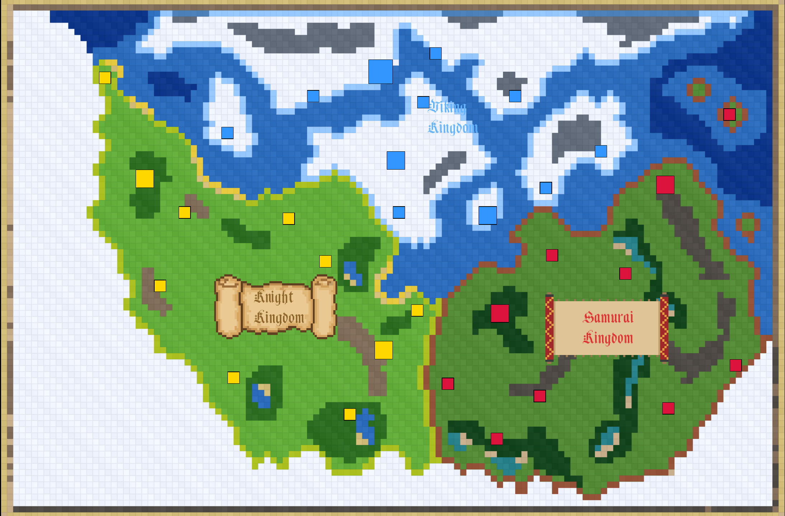
>>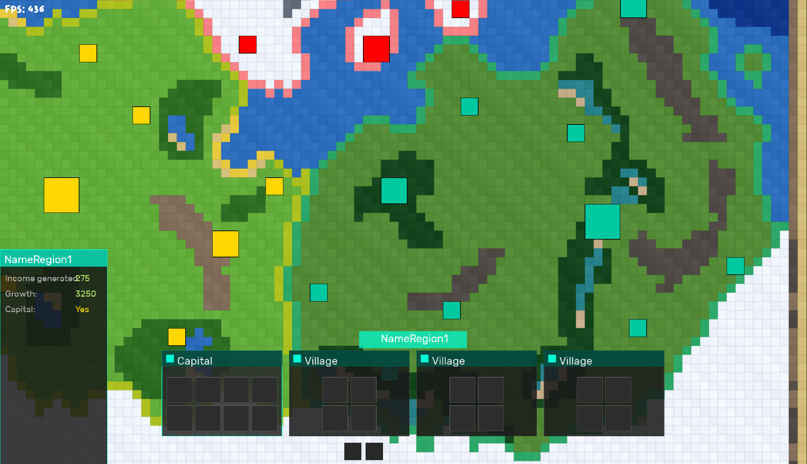
 

---

>### 🦌 Deer Invaders
>>
>>**Genre:** Shoot Em Up (SDL_Library, C++, Design-Patterns)  
>>**Status:** Finished (3 months)  
>>
>>This game is developed in C++ using the  **SDL 3.4 library**, where I'm coding every aspect of the game from scratch.I focused heavily on using **Design Patterns** to ensure a modular system, optimized performance, and clean game logic.
>>  
>>The game is inspired by Chicken Invaders and Space Invaders 1978.
>>  

>>

>>
<strong> All Mechanics I've Implemented (Click to open)</strong>

>>
>>-  **Architecture**: Utilized **Singleton**, **State**, **Observer**, **Object Pool** and **Command** patterns to manage global systems, game states, and memory-efficient entity spawning. Added **Steamworks SDK** into the build
>>-  **Entity Logic**: Developed a system for player movement and shooting system, meteor physics, meat physics, and deer behavior using optimized C++ classes.
>>-  **Wave & Meat System**: Implemented a dynamic wave spawner and a Meat currency system to track player progression and rewards. Different Waves inside different Levels with each of them having a narrative Introduction.
>>-  **Economy & Loadout**: Implemented a functional Shop system allowing players to purchase different weapons and shields to customize their progression.
>>-  **Technical Art**: Modeled all sprites and integrated them into the SDL rendering pipeline for a cohesive 2D aesthetic.
>>

>>
>>

>>
<strong> 2D Models (Click to open)</strong>

>>
>>- Deer Shape 
>>- Strawberries
>>- Meteor
>>- Meat
>>- Bullets/Shields
>>- Player Ship
>>- Missiles
>>- Heal Icon
>>

>> 

>>
>> #### ▶️ Gameplay Video
>>[🦌 Deer Invaders – Gameplay](https://youtu.be/kmVUhDSkX6Q)
>>
>>#### 📸 Screenshots
>>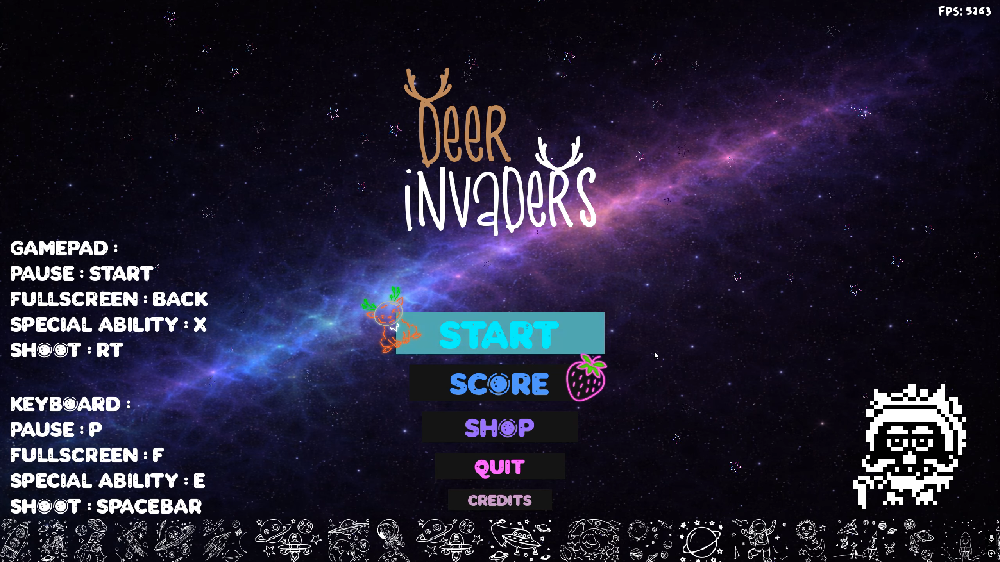
>>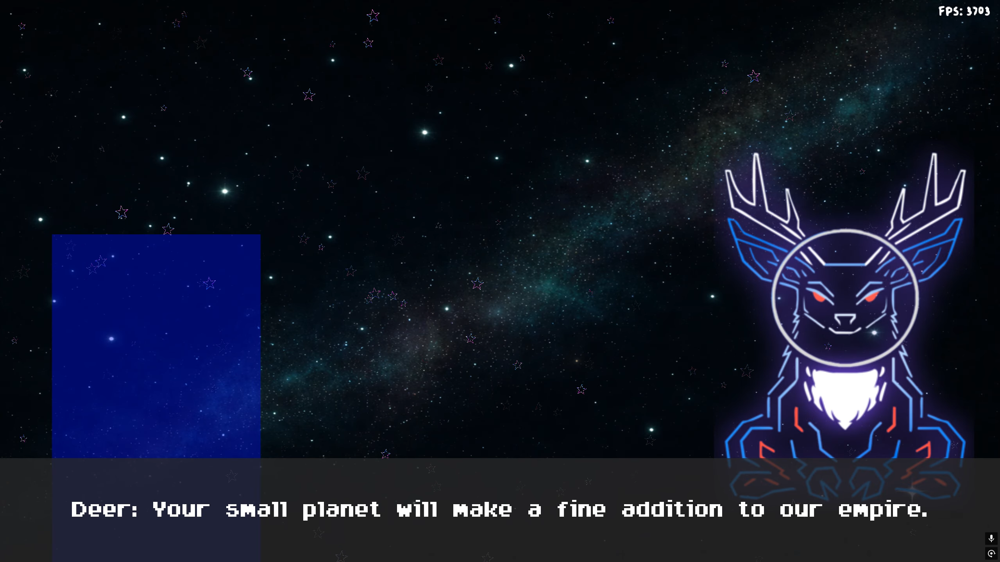 
>>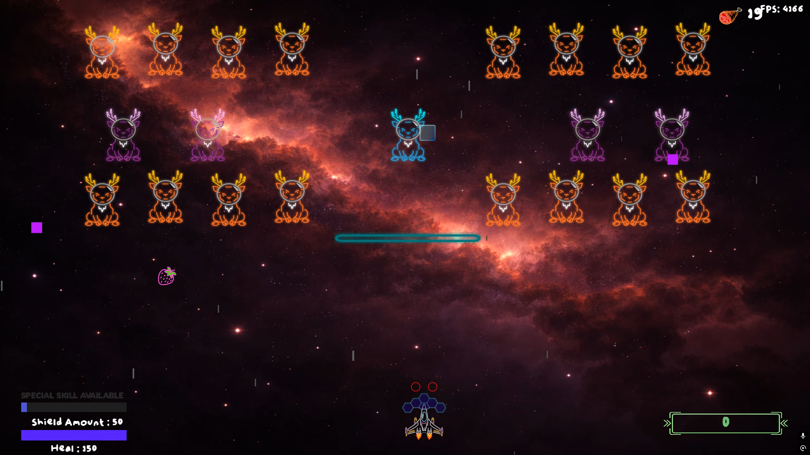 
 

---

>### 🥌 Curling Game
>>
>>**Genre:** Sport (Unreal Engine, Maya, Mixamo, C++, Blueprints)  
>>**Status:** Finished (2 months)  
>>
>>This project focuses on developing custom gameplay mechanics in **C++** within **Unreal Engine** to develop custom gameplay mechanics. I also simulate the movement of a stone realistically. The game is a unique blend of curling and combat. All assets including the stones, brooms, hacks, and houses were modeled in Maya 2025 by myself.
>>

>>

>>
<strong> All Functions I've Implemented (Click to open)</strong>

>>
>>-  **Character & Gameplay Systems**: Designed and programmed character movement and camera, input handling, interactions, and emotes using a C++ and Blueprint hybrid approach.
>>-  **Game Logic & Rules**: Implemented core gameplay rules and curling win conditions strictly in C++ for performance and reliability. 
>>-  **Physics & Mechanics (C++)**: Developed custom physics for stone curling functions, launch power (impulse), and dynamic friction calculations. 
>>-  **Software Architecture**: Applied Object-Oriented Programming (OOP) principles, specifically Inheritance, to manage distinct behaviors for Red and Blue stones. 
>>-  **Environment & Lighting**: Created a dynamic Day/Night cycle and lighting system using Blueprints.
>>

>>
>>

>>
<strong> 3D Models I've Made (Click to open)</strong>

>>
>>- Curling Stones 
>>- House Circles  
>>- Brooms 
>>- Hack
>>

>> 

>>
>> #### ▶️ Gameplay Video
>>[Curling Game – Gameplay](https://youtu.be/OiZBkVpFHXU)
>>
>> #### 📸 Screenshots
>>
>>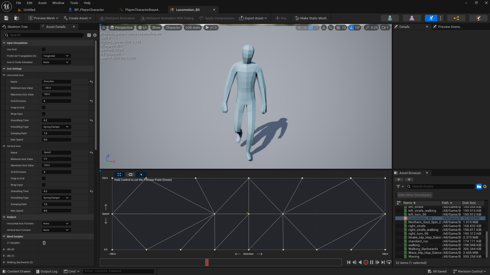

---

>### 🎥 Camera Top Down RTS/Total War
>>
>>**Genre:** 3D Camera Simulated of Total War Games (Unreal Engine, Blueprints)  
>>**Status:** Finished (2 months)  
>>
>>This prototype was made in Unreal Engine with Blueprints to develop and create a camera and the feel of a Total War game. I also simulate the click when the mouse is close to the character. This prototype has been a good base to learn more about the camera movement possibilities and the click on character mechanic.
>>
>>This prototype is inspired by **Total War : Rome 2**
>>

>>
>>

>>
<strong> All Functions I've Implemented (Click to open)</strong>

>>
>>-  **Advanced Camera System:** Designed a top-down movement system including smooth panning, rotation, and zooming **Zoom +/-** functionality.
>>-  **Unit Selection:** Programmed a character selection system where units become active and controllable only when clicked by the player.
>>-  **Edge Scrolling:** Developed logic to detect the cursor's position on the viewport, triggering camera movement when the mouse hits the **top, bottom, or side edges** of the screen.
>>-  **Visual Feedback (UX):** Implemented dynamic visual highlights and hover effects that trigger when the mouse cursor points at a character.
>>-  **Input Handling:** Created a responsive control scheme tailored for tactical strategy games, ensuring fluid navigation across the battlefield. 
>>

>>

>>
>> #### ▶️ Gameplay Video
>>[Camera RTS/Total War – Gameplay](https://youtu.be/ZNUgTf6YLpA)
>>
>> #### 📸 Screenshots
>>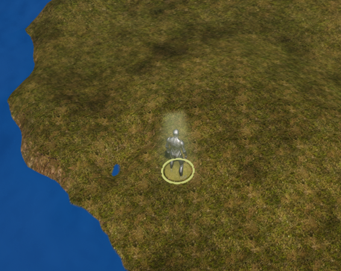

---

>### 🎨 3D Sheriff Office (Asset)
>>
>>**Status:** Finished (4 months)  
>>
>>This project focuses on the high-quality creation of environment assets inspired by the Office of **Red Dead Redemption**. The goal was to create and implement the assets inside Unreal Engine , from modeling to engine optimization, ensuring assets are both visually stunning and performance-friendly.
>>
>> My inspiration was Red Dead Redemption 2
>>

>>

>>
<strong> 3D Models I've Made (Click to open)</strong>

>>
>>- Table
>>- Horse Hitching post
>>- Sheriff Office
>>

>>

>>
>> #### 📸 Screenshots
>>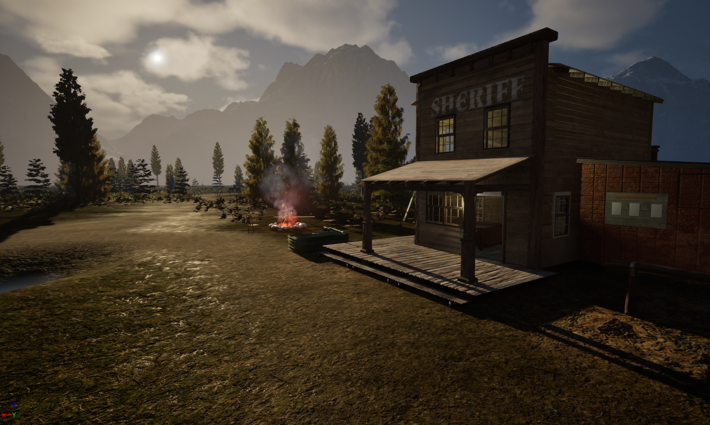
>>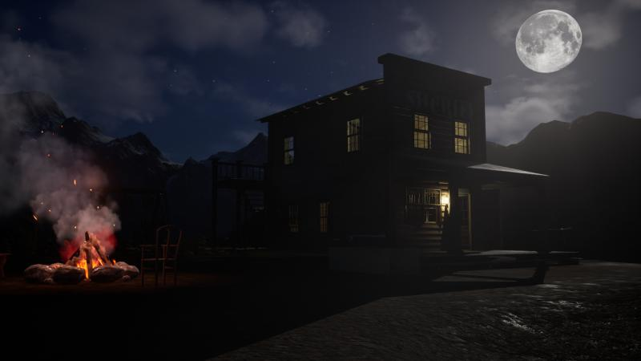

---

>### 🦌 Deer Hunt
>>
>>**Genre:** Hunting (Unreal Engine, Blueprints)  
>>**Status:** Finished (3 months)  
>>
>>This prototype was made in Unreal Engine 5 with Blueprints to develop a Day/Night cycle, deer and wolves with behaviour, and pick up/drop mechanic.
>>It was interesting to see the different possibilities I could do with a different engine from Unity.
>>

>>

>>
<strong> All Functions I've Implemented (Click to open)</strong>

>>
>>-  **AI Behaviour**: Implemented two distinct AI behaviors : 
>>  - **(Deer)**: They move around with different animations. If they see the player they try to run away
>>  - **(Wolves)**: They move around and idle with different animation. If they see the player then they try to attack him. 
>>-  **Combat & Interaction**: Programmed a weapon pickup system and a projectile-based shooting mechanic.
>>-  **Environment System**: Created a dynamic **Day/Night cycle** to enhance immersion and affect visibility during day and night.
>>-  **Game Menu and UI**: Menu and options available
>>

>>

>>
>> #### ▶️ Gameplay Video
>>[Deer Hunt – Gameplay](https://youtu.be/gTsUlmAq7yY)
>>
>> #### 📸 Screenshots
>>

---

>### 🏃 Infinite Runner
>>
>>**Genre:** Endless Runner (Unity, Mixamo, C#)  
>>**Status:** Finished (4 months)
>>
>>This prototype was made with Unity, focusing on procedural level generation and character state management. The project has a smooth graphic design and a smooth player feedback loops.
>>

>>

>>
<strong> All Functions I've Implemented (Click to open)</strong>

>>
>>-  **Procedural Generation**: Developed a modular system that dynamically spawns 3 possible map segments that I created as the player advances, making it an "infinite" gameplay loop.
>>-  **Performance Optimization**: Implemented a cleanup logic to destroy past map segments has the player advance and generate not too far ahead to save performance.
>>-  **Character & Animation**: Programmed the player movement left/right and integrated **Mixamo** animations for fluid transitions and death.
>>-  **UI & Game Loop**: Designed a custom death menu and a scoring system that tracks player distance and coins.
>>

>>

>>
>> #### ▶️ Gameplay Video
>>[Endless Runner – Gameplay](https://youtu.be/RxkOhHSXPvk)
>>
>> #### 📸 Screenshots
>>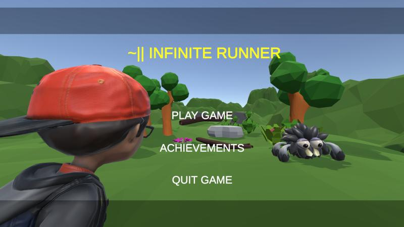
>>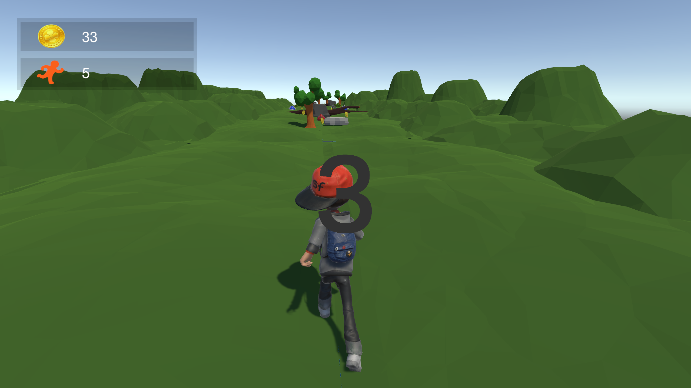
